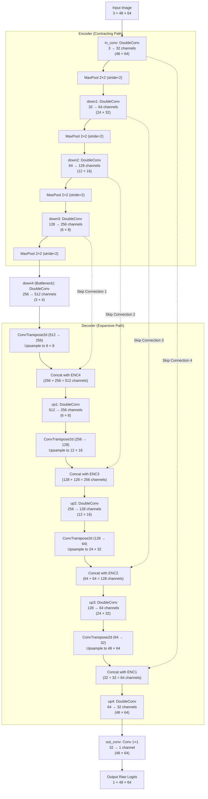
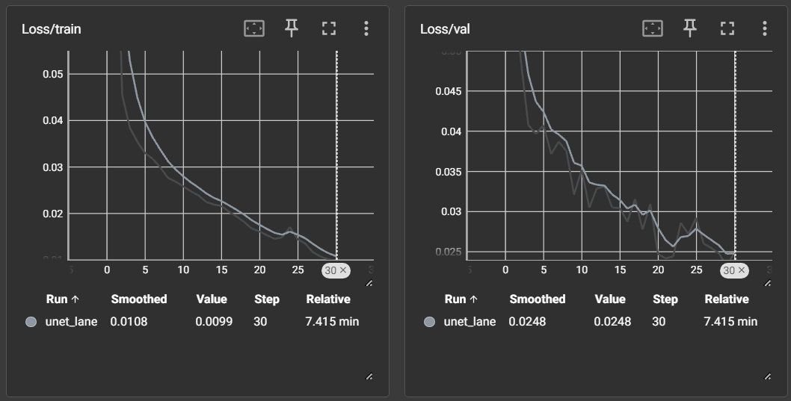
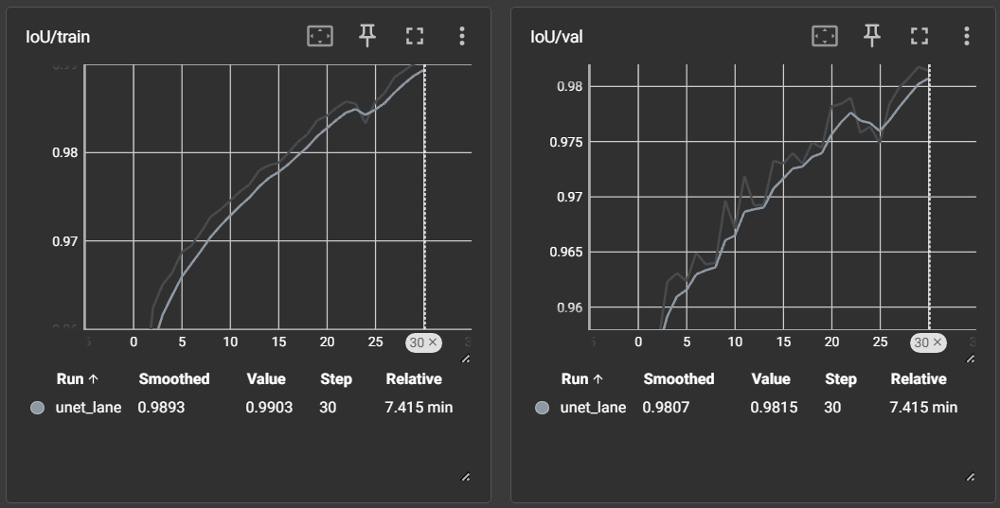
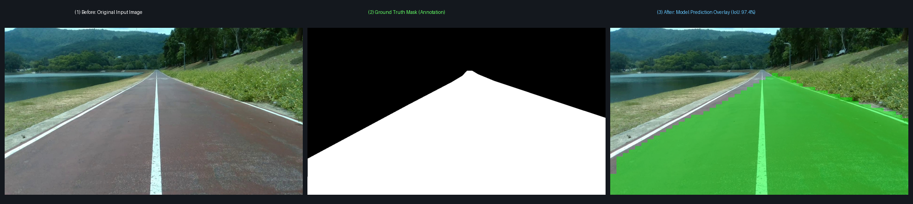

# Custom UNet Lane Segmentation
โครงข่ายประสาทเทียมแบบ Custom U-Net สำหรับงานแบ่งส่วนเส้นเลนถนน (Lane Segmentation) ระดับพิกเซล (Single-Class Binary Segmentation: เลนถนน = 1, พื้นหลัง = 0) 

### Setup
```bash
pip install -r requirements.txt
```
### Train
```bash
python train.py --data-root dataset --epochs 30 --batch-size 4
```
```bash
tensorboard --logdir runs
```
### Inference
```bash
python inference.py --images-dir dataset/images/test --checkpoint checkpoints/unet_lane/best.pt --run-name test_exp
```
### Evaluate
```bash
python evaluate.py --images-dir dataset/images/test --labels-dir dataset/labels/test --pred-masks-dir run/test_exp/masks
```

## โครงสร้างสถาปัตยกรรมของ Neural Network พร้อมเหตุผลประกอบ

สถาปัตยกรรม ถูกดัดแปลงจากโครงสร้างพื้นฐานของ U-Net ที่อยู่ในไฟล์ `model.py` เพื่อให้เหมาะกับภาพอินพุต $48 \times 64$ พิกเซล และเหมาะสำหรับงานตรวจจับที่ต้องการความเร็ว


### ภาพรวมและการกำหนดมิติข้อมูล
- Input Tensor คือ `(Batch_Size, 3, 48, 64)` ภาพสี RGB ที่มีความสูง 48 พิกเซลและกว้าง 64 พิกเซล 
- Output Tensor คือ `(Batch_Size, 1, 48, 64)` ผลลัพธ์เป็น Binary Mask ขนาดเท่าเดิม
- จำนวนพารามิเตอร์ที่เรียนรู้ได้ทั้งหมด คือ 7,763,041 พารามิเตอร์ (~7.76M)
### บล็อกการประมวลผลพื้นฐาน (Building Blocks)
โครงข่ายประกอบด้วย 3 บล็อกหลักที่พัฒนาเป็นโมดูลใน `model.py`

#### 1. บล็อก DoubleConv (`DoubleConv`)
ทำหน้าที่สกัดฟีเจอร์เชิงลึกในแต่ละระดับความละเอียด โดยรักษามิติภาพให้คงเดิมเสมอ
- **โครงสร้าง:**

$$
\text{Input} \longrightarrow [\text{Conv } 3\times3 \ (\text{pad}=1, \text{bias}=\text{False})] \longrightarrow [\text{BatchNorm2d}] \longrightarrow [\text{ReLU}(\text{inplace}=\text{True})] \longrightarrow [\text{Conv } 3\times3] \longrightarrow [\text{BatchNorm2d}] \longrightarrow [\text{ReLU}] \longrightarrow \text{Output}
$$

- **เหตุผลประกอบการออกแบบ:**
   - **การใช้ `padding=1` กับ Kernel $3\times3$:** จะช่วยรักษามิติขนาดภาพให้คงที่ ช่วยให้สามารถเชื่อมต่อฟีเจอร์ข้ามฝั่ง (Skip Connection) ได้โดยไม่ต้องตัดขอบภาพทิ้ง
   - **การตั้งค่า `bias=False`:** เพราะมีเลเยอร์ `BatchNorm2d` ตามหลังซึ่งมีพารามิเตอร์ สำหรับเลื่อนแกน ($\beta$) อยู่แล้ว การใส่ bias ใน Conv2d จึงสิ้นเปลืองหน่วยความจำ
   - **`BatchNorm2d`:** ช่วยลดปัญหาการเลื่อน ของค่าการกระจายตัวของข้อมูล (Internal Covariate Shift) ทำให้โมเดลลู่เข้า (Converge) ได้เร็วและเสถียรขึ้น
   - **`ReLU(inplace=True)`:** ช่วยเพิ่มความไม่เป็นเชิงเส้นของโมเดล และการเปิดโหมด `inplace=True` ที่ช่วยลดการใช้หน่วยความจำ โดยเขียนทับค่าลงในหน่วยความจำเดิม

#### 2. บล็อก Downsampling (`Down`)
ทำหน้าที่ย่อขนาดมิติภาพในฝั่ง Encoder (Contracting Path) เพื่อขยายพื้นที่การมองเห็นของนิวรอน (Receptive Field)
- **โครงสร้าง:**

$$
\text{Input} \longrightarrow [\text{MaxPool2d } 2\times2 \ (\text{stride}=2)] \longrightarrow [\text{DoubleConv}(\text{in-ch}, \text{out-ch})] \longrightarrow \text{Output}
$$

- **เหตุผลประกอบการออกแบบ:**
  - **`MaxPool2d(2)`:**
  ย่อขนาดมิติภาพลงครึ่งหนึ่งในแต่ละแกน ทำการ Downsampling เพื่อประหยัดเวลาและหน่วยความจำ ช่วยขยาย Receptive Field ให้มองเห็นบริบทภาพกว้างขึ้น
   - **`DoubleConv`:** เพิ่มจำนวน Feature Channels เป็นสองเท่า เพื่อสกัดคุณลักษณะ (Semantic Features) ที่มีความซับซ้อนยิ่งขึ้น

#### 3. บล็อก Upsampling (`Up`)
ทำหน้าที่ขยายขนาดมิติภาพในฝั่ง Decoder (Expansive Path) และผสานข้อมูลรายละเอียดตำแหน่งจากฝั่ง Encoder
- **โครงสร้าง:**

$$
\text{Input} \longrightarrow [\text{ConvTranspose2d } 2\times2 \ (\text{stride}=2)] \longrightarrow [\text{Concat with Skip}] \longrightarrow [\text{DoubleConv}(\text{out-ch} \times 2, \text{out-ch})] \longrightarrow \text{Output}
$$

- **เหตุผลประกอบการออกแบบ:**
  - **`ConvTranspose2d`:** ทำการ Upsample แบบที่สามารถเรียนรู้ค่าน้ำหนักได้ (Learnable Upsampling) ขยายมิติเชิงพื้นที่ขึ้น 2 เท่า และลดจำนวนช่องสัญญาณลงครึ่งหนึ่ง
   - **`Skip Connection (Concat)`:** ในงาน Segmentation เส้นเลนถนนมีลักษณะเป็นเส้นต่อกัน การ Downsampling ซ้ำๆ อาจทำให้ข้อมูล ขอบและพิกัดสูญหายไป การดึง Feature Map จาก Encoder ที่ระดับเดียวกันมา Concatenate ทำให้ Decoder ได้รับข้อมูลทั้งถนน (Contextual Semantics) จากชั้นลึก และ ตำแหน่งขอบเขตเส้นเลน (Fine Spatial Details) จากชั้นตื้น
   - **`DoubleConv`:** รับ Channel ทั้ง 2 แล้วรวมกัน เพื่อทำการผสมฟีเจอร์ทั้งสองแหล่งและลดขนาด Channel ลงมาเท่ากับ Output Channel

### ผังโครงสร้างสถาปัตยกรรม (Architecture Diagram)

### ตารางโครงสร้างและมิติข้อมูลรายเลเยอร์ (Layer-by-Layer Breakdown)
| ชื่อเลเยอร์ / ส่วนประกอบในโค้ด | การทำงาน / โครงสร้างย่อย | มิติเอาต์พุต (C × H × W) | จำนวนพารามิเตอร์ (Params) | ขนาดหน่วยความจำพารามิเตอร์ (Float32) |
| :--- | :--- | :---: | :---: | :---: |
| **Input** | ข้อมูลภาพสี RGB ขาเข้า | $3 \times 48 \times 64$ | 0 | 0 KB |
| **`in_conv` (Encoder 1)** | DoubleConv(3, 32) | $32 \times 48 \times 64$ | 10,208 | 39.88 KB |
| **`down1` (Encoder 2)** | MaxPool(2) + DoubleConv(32, 64) | $64 \times 24 \times 32$ | 55,552 | 217.00 KB |
| **`down2` (Encoder 3)** | MaxPool(2) + DoubleConv(64, 128) | $128 \times 12 \times 16$ | 221,696 | 866.00 KB |
| **`down3` (Encoder 4)** | MaxPool(2) + DoubleConv(128, 256) | $256 \times 6 \times 8$ | 885,760 | 3,460.00 KB |
| **`down4` (Bottleneck)** | MaxPool(2) + DoubleConv(256, 512) | $512 \times 3 \times 4$ | 3,540,992 | 13,832.00 KB |
| **`up1` (Decoder 1)** | ConvTranspose(512, 256) + Concat + DoubleConv(512, 256) | $256 \times 6 \times 8$ | 2,295,040 | 8,965.00 KB |
| **`up2` (Decoder 2)** | ConvTranspose(256, 128) + Concat + DoubleConv(256, 128) | $128 \times 12 \times 16$ | 574,080 | 2,242.50 KB |
| **`up3` (Decoder 3)** | ConvTranspose(128, 64) + Concat + DoubleConv(128, 64) | $64 \times 24 \times 32$ | 143,680 | 561.25 KB |
| **`up4` (Decoder 4)** | ConvTranspose(64, 32) + Concat + DoubleConv(64, 32) | $32 \times 48 \times 64$ | 36,000 | 140.62 KB |
| **`out_conv` (Output Layer)** | Conv2d(32, 1, kernel_size=1) | $1 \times 48 \times 64$ | 33 | 0.13 KB |
| **รวมทั้งหมด (Total)** | **Custom UNet Architecture** | **$1 \times 48 \times 64$** | **7,763,041** | **29.61 MB (31,052,164 bytes)** |

### เหตุผลการออกแบบ

1. **ความเหมาะสมกับมิติอินพุตขนาด ($48 \times 64$ พิกเซล) :** ความสูง $48$ และความกว้าง $64$ สามารถหาร 2 ได้ลงตัว 4 ครั้ง ทำให้ได้จุด Bottleneck ขนาด $3 \times 4$ พอดี ไม่เกิดเศษพิกเซลตกหล่น และขยายย้อนกลับได้อย่างสมมาตร

2. **การคงขนาด Feature Channels เริ่มต้นที่ 32 (Base Channels = 32) :** ช่วยควบคุมจำนวนพารามิเตอร์ไม่ให้มากเกิน จนเกิดการ Overfitting กับชุดข้อมูลขนาดเล็ก และไม่น้อยเกินไปจนโมเดลไม่สามารถแยกความแตกต่างได้

3. **การออกแบบเอาต์พุตเป็น Raw Logits ไม่ผ่าน Sigmoid ในโมเดล :** ในโมดูล `UNet.forward()` ส่งออกค่าเป็น Raw Logits เพื่อนำไปใช้กับ `BCEWithLogitsLoss` ซึ่งใช้ฟังก์ชันทางคณิตศาสตร์แบบ Log-Sum-Exp Trick ภายใน ป้องกันปัญหา Numerical Underflow/Overflow ได้ดีกว่าการผ่าน Sigmoid แล้วเข้า BCELoss แยกต่างหาก

## กราฟของ Loss ที่แสดงการลู่เข้าของโมเดลที่ผ่านการเทรน
ฟังก์ชัน Loss ที่ออกแบบไว้ในระบบ คือ

$$
\mathcal{L}_{\text{total}} = 0.5 \times \mathcal{L}_{\text{BCE}} + 0.5 \times \mathcal{L}_{\text{Dice}}
$$

- **Binary Cross-Entropy Loss ($\mathcal{L}_{\text{BCE}}$):** ทำหน้าที่ตรวจสอบความถูกต้องของการจำแนกระดับพิกเซล
- **Dice Loss ($\mathcal{L}_{\text{Dice}}$):** มีเพื่อแก้ปัญหา **Class Imbalance** ในงาน Lane Segmentation ซึ่งพื้นที่ของเส้นเลนบนท้องถนนคิดเป็นสัดส่วนน้อยเมื่อเทียบกับพื้นหลัง

### กราฟการลู่เข้าของ Loss และค่า IoU จริง
กราฟ Loss จาก Tensorboard ที่ Training  จำนวน 30 Epochs 

จากกราฟ แสดงการลดลงอย่างต่อเนื่องของทั้ง Train Loss และ Validation Loss แสดงถึงการลู่เข้า โดยไม่เกิด Overfitting


จากกราฟ แสดงค่าความแม่นยำ IoU ที่เพิ่มขึ้นอย่างรวดเร็วตั้งแต่ช่วงแรก และขึ้นไปแตะระดับสูงสุดประมาณ **98%** ใน Epoch ที่ 29

## การวัดผลประสิทธิภาพของโมเดลที่ผ่านการเทรน
เกณฑ์และตัวชี้วัดประสิทธิภาพในไฟล์ `evaluate.py` ได้กำหนดเกณฑ์ไว้ดังนี้
1. **Detection Rate:** สัดส่วนของภาพที่ถือว่า "ตรวจพบเส้นเลนสำเร็จ" เมื่อค่า Pixel-wise IoU $> 0.60$
2. **Average IoU (Detected):** ค่าเฉลี่ย IoU เฉพาะในกลุ่มภาพที่ผ่านเกณฑ์ Detection
3. **Average IoU (All Images):** ค่าเฉลี่ย IoU ของภาพทั้งหมดในชุดทดสอบ
4. **Validation Loss & IoU:** ค่า Loss และ IoU บนชุดตรวจสอบจากรอบการเทรน

### ผลการวัดประสิทธิภาพจริงบนชุดทดสอบ (Test Set)
ผลการทดสอบเมื่อนำโมเดลที่ดีที่สุด ไปประเมินกับชุดข้อมูลทดสอบ **Test Set จำนวน 170 ภาพ**

| ตัวชี้วัด (Evaluation Metric) | เกณฑ์การตัดสิน | ผลที่วัดได้ |
| :--- | :--- | :---: |
| **จำนวนรูปภาพที่ประเมิน (Evaluated Images)** | ชุดทดสอบอิสระ (`dataset/images/test`) | 170 ภาพ | 
| **Detection Rate (IoU > 0.60)** | สัดส่วนภาพที่ค่า Pixel IoU เกินเกณฑ์ 0.60 | 100.0% (170/170) | 
| **Average IoU (Detected Results)** | ค่าเฉลี่ย IoU เฉพาะภาพที่ตรวจพบสำเร็จ | 0.9666 (96.66%) |
| **Average IoU (All Images)** | ค่าเฉลี่ย IoU ของรูปภาพทั้งหมด 170 รูป | 0.9666 (96.66%) |
| **Best Validation Loss** | ค่า Loss รวมต่ำสุดบน Validation Set | 0.0232 |
| **Best Validation Mean IoU** | ค่าเฉลี่ย IoU สูงสุดบน Validation Set | 0.9818  |


## ภาพเปรียบเทียบ Before / Ground Truth / After Inference



## ขนาด Memory Footprint ที่ใช้ในการ Inference
ได้เขียนสคริปต์ check_memory.py สำหรับดู Memory Footprint ได้ผลดังนี้
1. ขนาด Model ใน Checkpoint File
   - Size on Disk: 29.67 MB (31.11 MB Dec)
2. Model Static Weights & Buffers:
   - Total Trainable Parameters : 7,763,041
   - Weights Memory (Float32)   : 29.61 MB (31.05 MB Dec)
   - BatchNorm Buffers Memory   : 23.14 KB
   - Static Model In-Memory     : 29.64 MB (31.08 MB Dec)
3. Input Tensor:
   - Shape                      : (1, 3, 48, 64)
   - Elements                   : 9,216
   - Memory Footprint           : 36.00 KB

4. Layer-by-Layer Activation Memory (Forward Pass)

      | Layer / Stage | Output Shape | Memory |
      | :--- | :---: | ---: |
      | `in_conv` (Enc 1) | (1, 32, 48, 64) | 384.00 KB |
      | `down1` (Enc 2) | (1, 64, 24, 32) | 192.00 KB |
      | `down2` (Enc 3) | (1, 128, 12, 16) | 96.00 KB |
      | `down3` (Enc 4) | (1, 256, 6, 8) | 48.00 KB |
      | `down4` (Bottleneck) | (1, 512, 3, 4) | 24.00 KB |
      | `up1` (Dec 1) | (1, 256, 6, 8) | 48.00 KB |
      | `up2` (Dec 2) | (1, 128, 12, 16) | 96.00 KB |
      | `up3` (Dec 3) | (1, 64, 24, 32) | 192.00 KB |
      | `up4` (Dec 4) | (1, 32, 48, 64) | 384.00 KB |
      | `out_conv` (Output) | (1, 1, 48, 64) | 12.00 KB |
      Total Intermediate Activations  1.44 MB (1.51 MB Dec)

5. Theoretical Minimum In-Memory Footprint:
   - Weights + Buffers + Input + Activations = 31.11 MB (32.62 MB Dec)

6. Runtime Measured Memory Allocation:
   - PyTorch CUDA Memory Allocated : 31.14 MB (32.66 MB Dec)
   - PyTorch CUDA Peak Allocated   : 51.87 MB (54.39 MB Dec)
   - PyTorch CUDA Memory Reserved  : 84.00 MB (88.08 MB Dec)

---
model: https://storage.psu.ac.th/drive/d/f/1A8ZvGVu8Fu30aBrgIcKNXTqjCqrNg8K